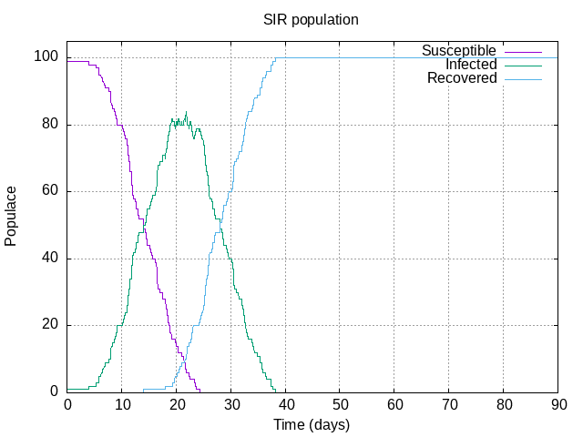
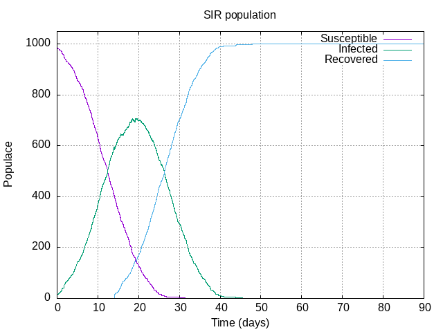
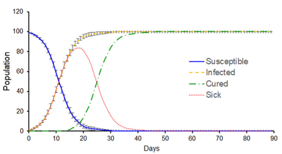

# Diffusive Model Reproducing the Spread of COVID-19 
> This repository rises as an undergraduate project to reproduce the main article's results ["Diffusion as a first model of spread of viral infection"](https://aapt.scitation.org/doi/10.1119/10.0001464). On the other hand, this is my version using C/C++ because original project is made using Python, and it can be found in [DiffusiveSIR](https://github.com/jpradas1/DiffusiveSIR), where I worked with more people.
>
> 
## Behind the code
> Before to explain how to run the code, here are some details to understand the algorithm behind it.
> There are two principal ideas behind the spread of disease as a SIR model (Susceptible-Infected-Recovered model):
> ### 1. Diffusive movement of every individual:
> We initialize simulation for a system of ***N*** non-interacting particles (populace) with the same diffusion constant ***D***, a fraction of the initial population to be infected, and population density ***p***, these define domain dimensions, i.e., a square of L=sqrt(N/***p***). Then each particle is assigned to a uniform random position inside the domain. And one can simulate the diffusion of a particle from its previous position by generating a Gaussian distribution of zero mean and variance ***2Dt***.
> 
> ### 2. Spread of disease within the code:
> Here appears specific-simulation variables. Thus at each step, namely, every time we move the whole system, each susceptible individual has the same ***probability to get sick*** if it is found whitin a distance less than ***transmision ratio***, because of this it can get sick. Finally, population just can be infected for ***14 days*** (in this case, but all these variable can be modified), so when this time is up individuals get recovered (which means really are recovered or dead).
> 
> A different colour depicts the state of every particle.
> - *Green*: Susceptible (it could get sick)
> - *Red*: Infected
> - *Yellow*: Recovered (really recovered or dead)
## Running the Code
> To get the SIR curves, run the `makefile`:
> ```bash
>   make
> ```
> This file contains information about all variables which are by default (these values are taken from main article to reproduce the spread in New York), where one can find:
> - N = 100 (number of non-interacting particles)
> - Inf = 0.011 (fraction of the initial population to be infected)
> - den = 0.012 (population density)
> - D = 100 (diffusive constant)
> - dt = 0.01 (time spet of evolution)
> - r_t = 14.0 (maximum period to be infected and spreed the disease)
> - i_d = 2.0 (transmision ratio in meter)
> - i_p = 0.2 (probability to get infected)
> Any of these can be easly modified by performing (e.g. diffusive constant):
> ```bash
>   make "D"=452 "other_variable"=value ...
> ```
>
> To get the initial gif just run:
> ```bash
>   make gif
> ```
> The data and images going to be alocated in `data` directory.
## Slight comparision of results
> This algorithm was run for New York values such as the main article does. So we find:
>
>  
> 
>
> First two images are from simulation for ***N=100*** and ***N=1000***, the last one is from the [original article](https://aapt.scitation.org/doi/10.1119/10.0001464), this for New York city.
